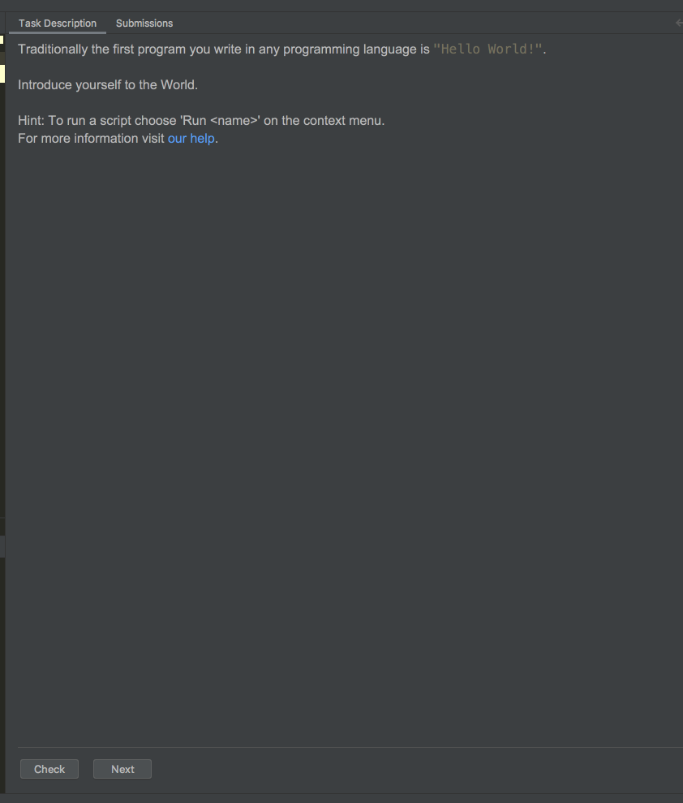

# Python Data Types

Understanding the data types and structures within any language are
critical to be effective at utilizing it to it's fullest.

Python has it's primary "built in" data types and then those have been
expanded upon greatly for various needs and reasons.

The objective this week is to go through the Intro to Programming course
in the Pycharm Edu edition you downloaded and installed.

In this course you will be guided through the basics of the python
language, learning about the primary data types and language syntax.

If you do not have Pycharm Educational edition you will need to download
it from [here.](https://www.jetbrains.com/education/download/#section=pycharm-edu)

1. Open the Pycharm Edu program.
   1. Windows: windows key and start typing pycharm until it shows up
   2. Mac: open spotlight (command + spacebar) and start typing pycharm
2. If you get asked to import settings and this is your first time ever
   using any Jetbrains product just select skip.
3. You may also get asked to register. If so just do it.
4. You should see a landing page that looks like below. Your screen may
   not say _"Learn and Teach"_ but it should be similar. Under it select
   _"Browse Courses"_

5. If Intro to python is not preselected search for it using the search
   box. When selected click the join button.

   
6.  Accept any defaults that you are asked to provide until you arrive
    at something like the image you see below.

7.  That view is the main course view. It consists of 3 parts. The
    course files, the code editor, and the instructions and test
    runners.

8.  You can jump around in the course but I would not recommend it for
    beginners. It will be best for you to go through and complete each
    section. The portions you have not completed will have an empty
    checkbox. The ones you have completed successfully will fill in with
    green as you see in the picture below.

9. In the center is the code you will need to edit for the exercise. See
   the play button in the top right? Clicking it will run the code in
   that file similar to what we have previously done in the command line
   with `python3 <filename>.py`. The results of your fule running will
   appear in the console panel at the bottom. It can be expanded or
   minimized as you desire. The play button that appears there will also
   re run your code.

10.  In the right panel is the section instructions. It will tell you a
     little about the "challenge" for the section and teach you what is
     expected. When you think you have what they are asking for in your
     code window you can press the Check button at the bottom of this
     section. This will run some tests on your code and result in a
     pass/fail. Once you have passed click the next button and move to
     the next section. If at any point you feel like you need to review
     a previous section hop back over to it by double clicking that
     section in the course view on the far left.

<!-- Latest compiled and minified CSS & JS -->
<link rel="stylesheet" media="screen" href="//netdna.bootstrapcdn.com/bootstrap/3.1.0/css/bootstrap.min.css">
